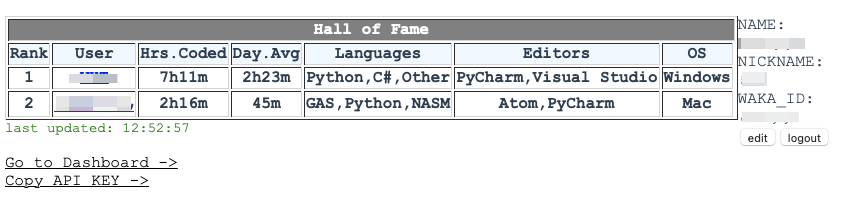

# wakatime-leaderboard

self-hosted wakatime private leaderboard.

## Introduction

The leaderboard use wakatime api to get data. To use the leaderboard,
a user must:

* Display his code time/languages/systems publicly in his privacy preference.
* Set Display time to `last 7 days`

### Screenshot



## Project setup
```
npm install
```

### Compiles and hot-reloads for development
```
npm run serve
```

### Compiles and minifies for production
```
npm run build
```

### Lints and fixes files
```
npm run lint
```

### Customize configuration
See [Configuration Reference](https://cli.vuejs.org/config/).
